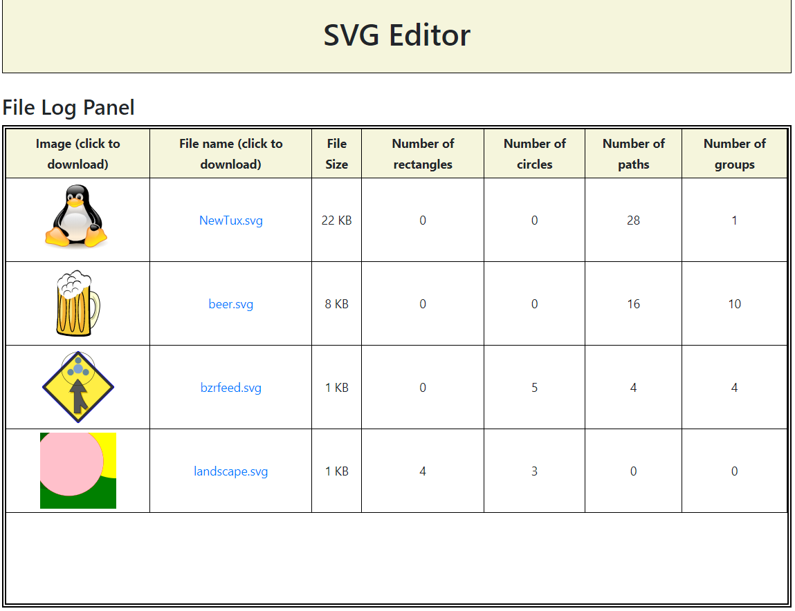
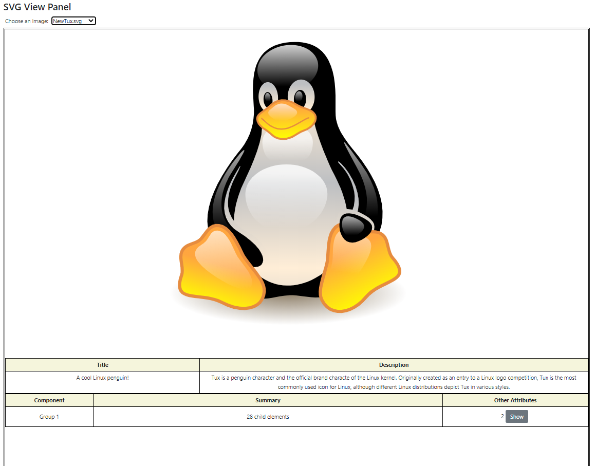
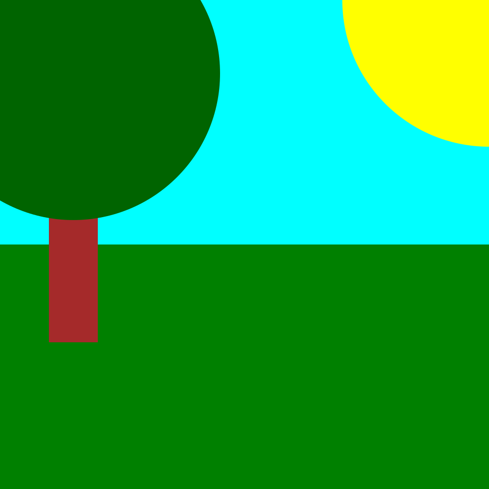

* A web-based SVG image editor with a JavaScript / HTML front-end, C back-end, hosted on a Node.js server.
* Web GUI allows for viewing, manipulation (e.g. adding / changing components), saving and deletion (using SQL).
* Uses an SVG parser and validator API in C using the libxml2 library.

# What does this web application look like?

# Example image made with this application.

Contributors: James Moreau, Denis Nikitenko
